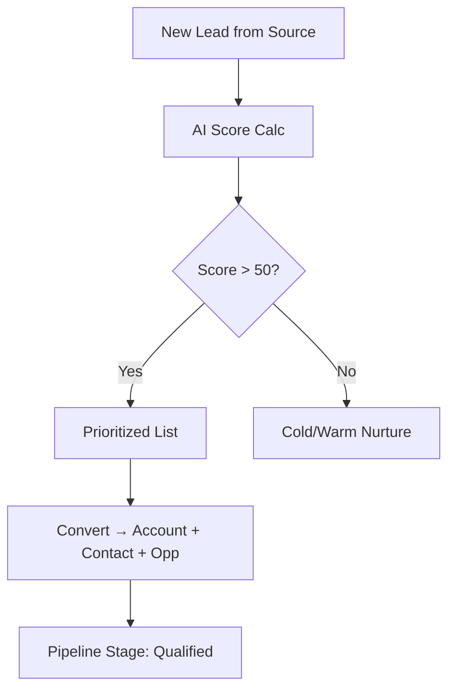
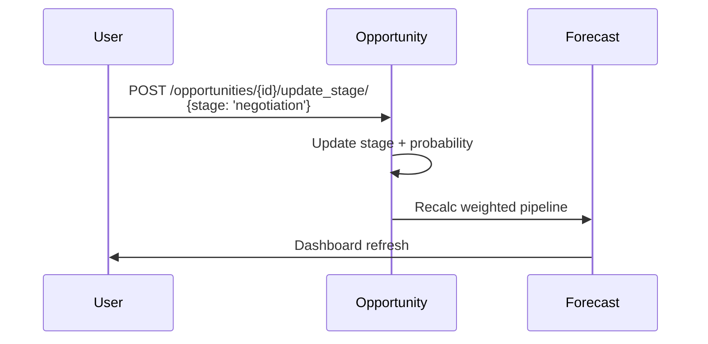
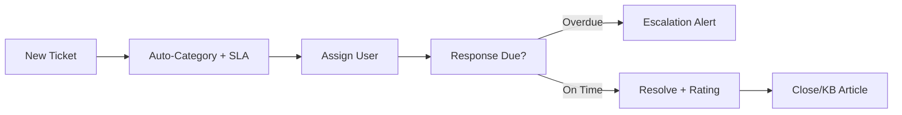
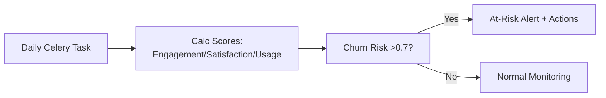

# CRM Module — Components & Workflows
**Project:** SAP-Python  
**Base URL:** `https://sap.athenas.co.in/api/crm/`  

## Architecture Overview

```
crm/
├── models.py              — Core (Lead, Account, Opportunity)
├── viewsets.py            — CompanyScoped ViewSets
├── ai_analytics.py        — AI insights/forecasting
├── lead_scoring.py        — AI lead scoring
├── security_utils.py      — Input validation
└── urls.py                — Routing
```

## Core Components

### 1. Lead & Pipeline Management
| Sub-Component | Models | Key Features |
|---------------|--------|--------------|
| Leads | Lead, LeadScore | AI scoring (behavioral/demographic) |
| Pipeline | Opportunity, Deal, PipelineStage | Stage history, weighted forecast |
| Conversion | Convert lead → Account/Contact/Opp | One-click automation |

### 2. Customer Management
| Sub-Component | Models | Key Features |
|---------------|--------|--------------|
| Accounts/Contacts | Account, Contact | Health scores, segments |
| Interactions | CustomerInteraction | Email/call/meeting tracking |

### 3. Activities & Campaigns
| Sub-Component | Models | Key Features |
|---------------|--------|--------------|
| Activities | Activity | Overdue alerts, AI conversation analysis |
| Campaigns | Campaign | Member tracking, ROI metrics |

### 4. Support & Knowledge
| Sub-Component | Models | Key Features |
|---------------|--------|--------------|
| Tickets | Ticket, Category, SLA | Auto-assign, overdue |
| KB | KnowledgeBase | Search, helpful count |

### 5. Analytics & AI
| Sub-Component | Models | Key Features |
|---------------|--------|--------------|
| Health/Churn | CustomerHealthScore | Composite scores, at-risk lists |
| Forecasting | SalesAnalytics | Pipeline velocity, CAC/LTV |

## Detailed Workflows

### Lead to Opportunity Workflow


### Sales Pipeline Workflow


### Ticket Resolution Workflow


### Customer Health Monitoring


## API Endpoints Summary

| Category | Key Endpoints |
|----------|---------------|
| Dashboard | GET /dashboard/ai_insights/ |
| Leads | POST /leads/{id}/convert_to_opportunity/ |
| Pipeline | GET /opportunities/forecast/ |
| Support | POST /tickets/{id}/resolve/ |
| AI | GET /customer-health-scores/at_risk/ |

**Full blueprint**: See CRM_Blueprint.md

## Integration Notes
- **Finance**: Opportunities → Quotations/Invoices.
- **AI**: Lead scoring, conversation intelligence, weekly reports.
- **Cache**: Redis for dashboard/funnel stats.

