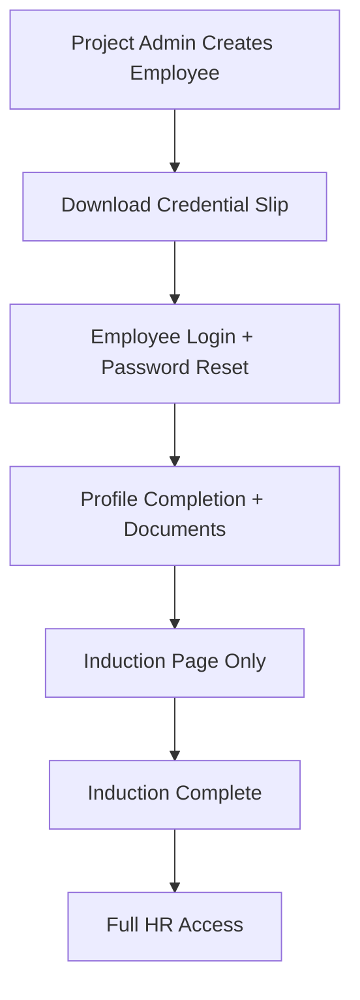
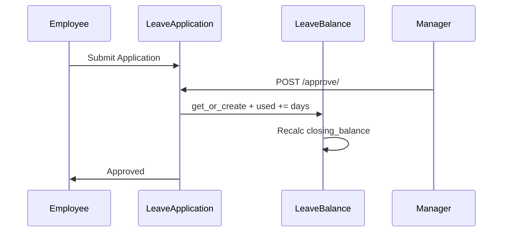
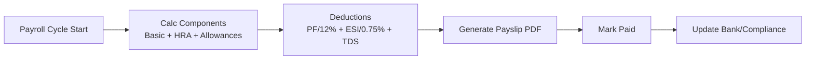
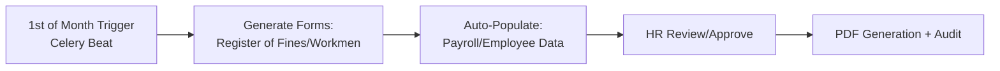

# HR Module — Components & Workflows
**Project:** SAP-Python  
**Base URL:** `https://sap.athenas.co.in/api/hr/`  

## Architecture Overview

```
hr/
├── models.py                  — Core models (Employee, Department, etc.)
├── leave_models.py            — Leave management
├── payroll_views.py           — Payroll processing
├── attendance_views.py        — Attendance tracking
├── statutory_views.py         — Compliance (PF, ESI, TDS)
├── form_automation_views.py   — Monthly form generation
└── urls.py                    — API routing
```

## Core Components

### 1. Employee Management
| Sub-Component | Models | Key Features |
|---------------|--------|--------------|
| Org Structure | Department, Designation | Hierarchy, auto-code (DEPT001) |
| Employee Master | Employee | Statutory details (PAN, PF, ESI), skills JSON |
| Onboarding | Workflow models | Profile completion, document upload |

### 2. Leave Management
| Sub-Component | Models | Key Features |
|---------------|--------|--------------|
| Configuration | LeaveType | Carry-forward, approval rules |
| Balances | LeaveBalance | Auto-init/recalc, year-wise |
| Applications | LeaveApplication, Holiday | Calendar view (month-spanning), exports |

### 3. Attendance Management
| Sub-Component | Models | Key Features |
|---------------|--------|--------------|
| Records | AttendanceRecord | GPS/biometric, overtime calc |
| Devices | AttendanceDevice, Log | Sync support |

### 4. Payroll & Compliance
| Sub-Component | Models | Key Features |
|---------------|--------|--------------|
| Payroll | Payroll, Payslip | HRA/PF/ESI/TDS auto-calc |
| Statutory | PFRecord, ESIRecord | ECR/return generation |

### 5. Recruitment
| Sub-Component | Models | Key Features |
|---------------|--------|--------------|
| Jobs | JobPosting, Application | Public portal, AI screening |

## Detailed Workflows

### Employee Onboarding Workflow


### Leave Approval Workflow


### Payroll Processing Workflow


### Monthly Compliance Forms


## API Endpoints Summary

| Category | Key Endpoints |
|----------|---------------|
| Employee | GET/POST/PUT/DEL /employees/ |
| Leave | POST /leave-applications/{id}/approve/ |
| Payroll | POST /payroll/{id}/process/ |
| Attendance | POST /attendance/mobile/ (GPS) |
| Compliance | POST /statutory/generate-pf-ecr/ |

**Full blueprint**: See HR_Blueprint.md

## Integration Notes
- **Finance**: Payroll payments link to Payments.
- **Celery**: Monthly forms, ECR filing.
- **Security**: SQL/XSS validation on all inputs.

