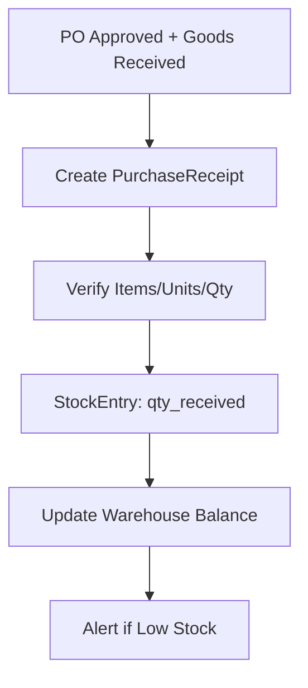
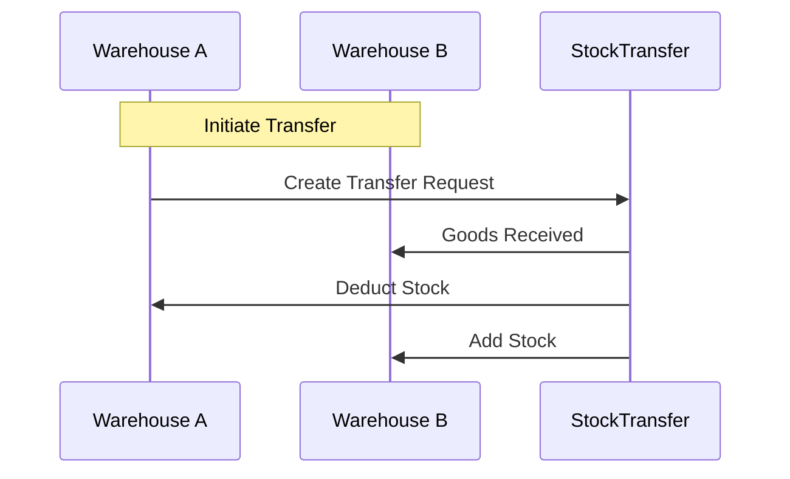
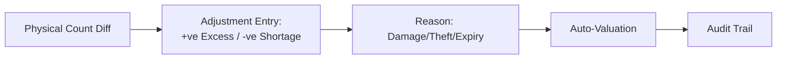
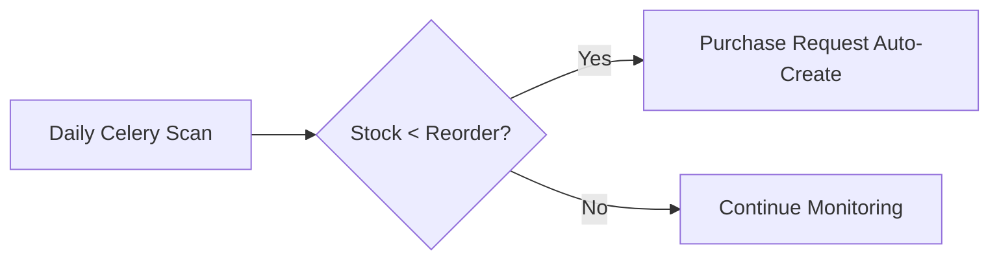

# Inventory Module — Components & Workflows
**Project:** SAP-Python  
**Base URL:** `https://sap.athenas.co.in/api/inventory/`  

## Architecture Overview

```
inventory/
├── models.py           — Core stock models
├── views.py            — CRUD + adjustments
├── urls.py             — API routing
└── utils.py            — Stock calculations
```

## Core Components

### 1. Master Data
| Sub-Component | Models | Key Features |
|---------------|--------|--------------|
| Products | Product (shared w/ Finance) | HSN/SAC, units (NOS/KG), pricing |
| Categories | Category | Hierarchical (code: CAT001) |
| Suppliers | Supplier/Vendor | Linked to Procurement |

### 2. Locations & Stock
| Sub-Component | Models | Key Features |
|---------------|--------|--------------|
| Warehouses | Warehouse | Multi-location, transfers |
| Stock | StockEntry, StockTransfer | Serial/batch tracking |

### 3. Transactions
| Sub-Component | Models | Key Features |
|---------------|--------|--------------|
| Receipts | PurchaseReceipt | From PO/vendor invoice |
| Issues | StockIssue | To production/sales |

## Detailed Workflows

### Stock Receipt Workflow


### Stock Transfer Workflow


### Inventory Adjustment


### Low Stock Alert


## API Endpoints Summary

| Category | Key Endpoints |
|----------|---------------|
| Products | GET/POST /products/ (shared) |
| Stock | POST /stock-entries/ |
| Transfers | POST /stock-transfers/ |
| Reports | GET /stock-analytics/ |

**Inferred from**: App catalog, units fixes, HSN.csv.

## Integration Notes
- **Procurement**: PO → PurchaseReceipt → Stock.
- **Finance**: Product pricing/units sync.
- **Numbering**: INV000123, atomic counters.

