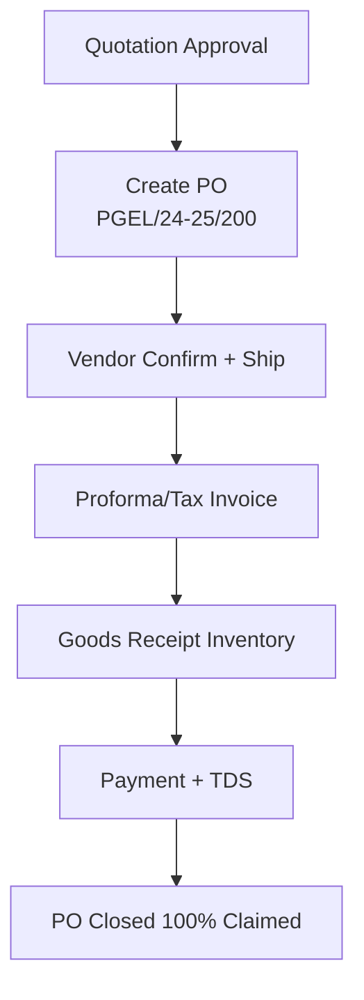
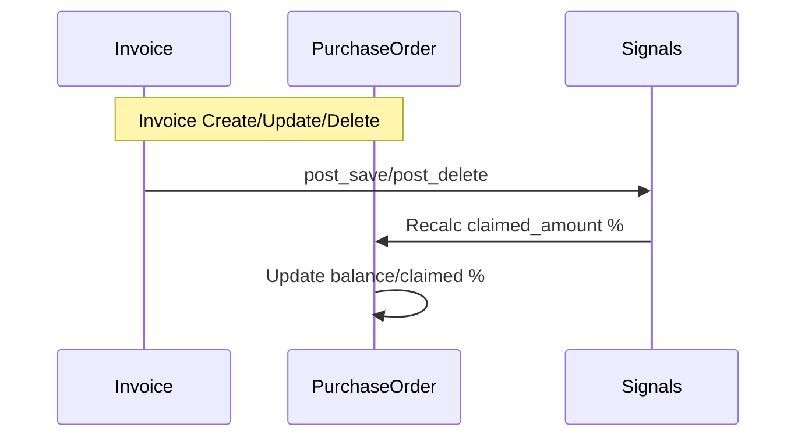
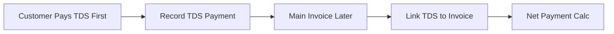

# Procurement Module — Components & Workflows
**Project:** SAP-Python  
**Base URL:** `https://sap.athenas.co.in/api/finance/purchase-orders/` (Procurement via Finance)  

## Architecture Overview

```
finance/
├── models.py              — PO, PurchaseRequest, VendorInvoice
├── signals.py             — PO claimed updates
├── management/commands/   — Fix scripts
└── views.py               — PO CRUD + actions
```

## Core Components

### 1. Purchase Documents
| Sub-Component | Models | Key Features |
|---------------|--------|--------------|
| Requests | PurchaseRequest | Approval workflow |
| Orders | PurchaseOrder, Item | Item-wise claiming, shipping |
| Invoices | VendorInvoice | Matching to PO |

### 2. Payments & TDS
| Sub-Component | Models | Key Features |
|---------------|--------|--------------|
| Payments | PurchasePayment | TDS-only support |
| TDS | TDSRecord | Advance TDS handling |

### 3. Numbering & Tracking
| Sub-Component | Models | Key Features |
|---------------|--------|--------------|
| Smart Numbering | NumberingRule | PGEL/24-25/200 format |
| Claim Tracking | PO claimed % | Signal-based sync |

## Detailed Workflows

### End-to-End PO Workflow


### Claim Percentage Update


### TDS-Only Payment


## API Endpoints Summary

| Category | Key Endpoints |
|----------|---------------|
| PO | POST /purchase-orders/create_from_quotation/ |
| Details | GET /purchase-orders/{id}/ (ignore_fy_filter) |
| Payments | POST /purchase-payments/ (TDS support) |
| Fixes | Management commands (claimed sync) |

**Evidence**: PO fixes, signals, TDS docs, units integration.

## Integration Notes
- **Finance**: PO → Invoice flow.
- **Inventory**: PO → Goods Receipt.
- **Numbering**: FY-aware (24-25), atomic.
- **Signals**: Auto-update claimed on invoice changes.

